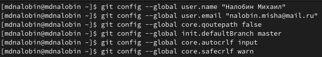

---
## Front matter
title: "Лабораторная работа №2"
subtitle: "Система контроля версий Git"
author: "Налобин Михаил Дмитриевич"

## Generic otions
lang: ru-RU
toc-title: "Содержание"

## Bibliography
bibliography: bib/cite.bib
csl: pandoc/csl/gost-r-7-0-5-2008-numeric.csl

## Pdf output format
toc: true # Table of contents
toc-depth: 2
lof: true # List of figures
lot: true # List of tables
fontsize: 12pt
linestretch: 1.5
papersize: a4
documentclass: scrreprt
## I18n polyglossia
polyglossia-lang:
  name: russian
  options:
	- spelling=modern
	- babelshorthands=true
polyglossia-otherlangs:
  name: english
## I18n babel
babel-lang: russian
babel-otherlangs: english
## Fonts
mainfont: PT Serif
romanfont: PT Serif
sansfont: PT Sans
monofont: PT Mono
mainfontoptions: Ligatures=TeX
romanfontoptions: Ligatures=TeX
sansfontoptions: Ligatures=TeX,Scale=MatchLowercase
monofontoptions: Scale=MatchLowercase,Scale=0.9
## Biblatex
biblatex: true
biblio-style: "gost-numeric"
biblatexoptions:
  - parentracker=true
  - backend=biber
  - hyperref=auto
  - language=auto
  - autolang=other*
  - citestyle=gost-numeric
## Pandoc-crossref LaTeX customization
figureTitle: "Рис."
tableTitle: "Таблица"
listingTitle: "Листинг"
lofTitle: "Список иллюстраций"
lotTitle: "Список таблиц"
lolTitle: "Листинги"
## Misc options
indent: true
header-includes:
  - \usepackage{indentfirst}
  - \usepackage{float} # keep figures where there are in the text
  - \floatplacement{figure}{H} # keep figures where there are in the text
---

# Цель работы

Целью работы является изучие идеологии и применения средств контроля
версий git, а также приобретение практических навыков по работе с ее
системой.

# Ход работы

##Настройка github

Зарегистрировались на github, после чего заполнили основные данные (рис. @fig:001).

{#fig:001 width=70%}

##Базовая настройка git	

Предварительная конфигурация системы git (рис. @fig:002).

{#fig:002 width=70%}

##Создание SSH ключа

Создадим SSH ключ для последующей идентификации пользователя на
сервере репозиториев (рис. @fig:003).

{#fig:003 width=70%}

Далее прочитаем файл, содержащий SSH ключ, и скопируем его данные (рис. @fig:004).

{#fig:004 width=70%}

Теперь загрузим ключ в учетную запись на github (рис. @fig:005).

{#fig:005 width=70%}

##Создание рабочего пространства и репозитория курса на основе шаблона

Создали рабочее пространство через команду mkdir для предмета “Архитектура компьютера” (рис. @fig:006).

{#fig:006 width=70%}

После чего переходим на страницу шаблона репозитория и используем, копируя этот репозиторий себе. В итоге Создали репозиторий у себя (рис. @fig:007).

{#fig:007 width=70%}

Затем уже в консоле переходим в каталог курса и клонируем созданный только что репозиторий, воспользовавшись ссылкой, скопированной со страницы этого же репозитория (рис. @fig:008).

{#fig:008 width=70%}

##Настройка каталога курса

Перешли в каталог курса удалили лишний файл, далее создали необходимые каталоги и отправили файлы на сервер (рис. @fig:009, @fig:010, @fig:011).

{#fig:009 width=70%}

{#fig:010 width=70%}

{#fig:011 width=70%}

После всех выполненных команд проверяем на странице репозитория правильность создания иерархии рабочего пространства. (рис. @fig:012).

{#fig:012 width=70%}

##Задачи для самостоятельной работы

Перед началом работы выполним стандартную процедуру (рис. @fig:013).

{#fig:013 width=70%}

1) Создадим файл отчета по выполнению лабораторной работы в соответсвующем каталоге рабочего пространства (рис. @fig:014).

{#fig:014 width=70%}

2) Скопировали, прежде удалив ненужные файлы, отчеты по выполнению предыдущих лабораторных работ(№1) в соответствующие каталоги созданного рабочего пространства (рис. @fig:015).

{#fig:015 width=70%}

3) Загрузили изменения на github (рис. @fig:016).

{#fig:016 width=70%}

# Выводы

В ходе лабораторной работы изучил, как используются средства котроля
версий, и приобрел практические навыки их применения по работе с ее
системой.

:::
