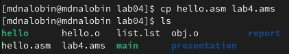

---
## Front matter
title: "Лабораторная работа №4"
subtitle: "Cоздание и процесс обработки программ на языке ассемблера NASM"
author: "Налобин Михаил Дмитриевич"

## Generic otions
lang: ru-RU
toc-title: "Содержание"

## Bibliography
bibliography: bib/cite.bib
csl: pandoc/csl/gost-r-7-0-5-2008-numeric.csl

## Pdf output format
toc: true # Table of contents
toc-depth: 2
lof: true # List of figures
lot: true # List of tables
fontsize: 12pt
linestretch: 1.5
papersize: a4
documentclass: scrreprt
## I18n polyglossia
polyglossia-lang:
  name: russian
  options:
	- spelling=modern
	- babelshorthands=true
polyglossia-otherlangs:
  name: english
## I18n babel
babel-lang: russian
babel-otherlangs: english
## Fonts
mainfont: PT Serif
romanfont: PT Serif
sansfont: PT Sans
monofont: PT Mono
mainfontoptions: Ligatures=TeX
romanfontoptions: Ligatures=TeX
sansfontoptions: Ligatures=TeX,Scale=MatchLowercase
monofontoptions: Scale=MatchLowercase,Scale=0.9
## Biblatex
biblatex: true
biblio-style: "gost-numeric"
biblatexoptions:
  - parentracker=true
  - backend=biber
  - hyperref=auto
  - language=auto
  - autolang=other*
  - citestyle=gost-numeric
## Pandoc-crossref LaTeX customization
figureTitle: "Рис."
tableTitle: "Таблица"
listingTitle: "Листинг"
lofTitle: "Список иллюстраций"
lotTitle: "Список таблиц"
lolTitle: "Листинги"
## Misc options
indent: true
header-includes:
  - \usepackage{indentfirst}
  - \usepackage{float} # keep figures where there are in the text
  - \floatplacement{figure}{H} # keep figures where there are in the text
---

# Цель работы

Целью данной лабораторной работы является освоение процедуры компиляции и сборки программ, написанных на ассемблере NASM.

# Ход работы

Перешли в каталог с лабораторной работой №4, создали текстовый файл hello.asm с помощью команды touch и открыли этот текстовый файл с использованием gedit(рис. @fig:001).

{#fig:001 width=70%}

В текстовом редакторе gedit ввели необходимые команды (рис. @fig:002).

{#fig:002 width=70%}

Превратили текст программы в объективный код с использованием NASM и проверили корректность выполнения (рис. @fig:003).

{#fig:003 width=70%}

Путем применения расширенного синтаксиса командной строки NASM выполнили команду компиляции файла hello.o в obj.o, после чего убедились в том, что все файлы были созданы (рис. @fig:004).

{#fig:004 width=70%}

Передали объектный файл hello.o на обработку компоновщику ld и проверили выполнение командой ls (рис. @fig:005).

{#fig:005 width=70%}

Передали объектный файл obj.o в ходе получим исполняемый файл с именем main, далее снова проверяем выполнение обработки компоновщика (рис. @fig:006).

{#fig:006 width=70%}

Запустили на выполнение созданный исполняемый файл, набрав в командой строке ./hello (рис. @fig:007).

{#fig:007 width=70%}

##Самостоятельная работа

Создали копию файла hello.asm с именем lab4.asm с помощью команды cp и проверили на наличие (рис. @fig:008).

{#fig:008 width=70%}

Пользуясь текстовым редактором gedit, внесли изменения в текст программы, в результате чего должны будем получить при выводе мои имя и фамилию (рис. @fig:009 и рис. @fig:010).

{#fig:009 width=70%}

{#fig:0010 width=70%}

Оттранслировали полученный текст в объектный файл (рис. @fig:011).

{#fig:011 width=70%}

Выполнили компоновку объектного файла и запустили получившийся исполняемый файл (рис. @fig:012).

{#fig:012 width=70%}

Загрузили все файлы на github (рис. @fig:013).

{#fig:013 width=70%}

# Выводы

В ходе данной лабораторной работы освоили процедуры компиляции и сборки программ, написанные на ассемблере NASM, на примере вывода сообщения 'Hello World!' и фамилией с именем.

:::
