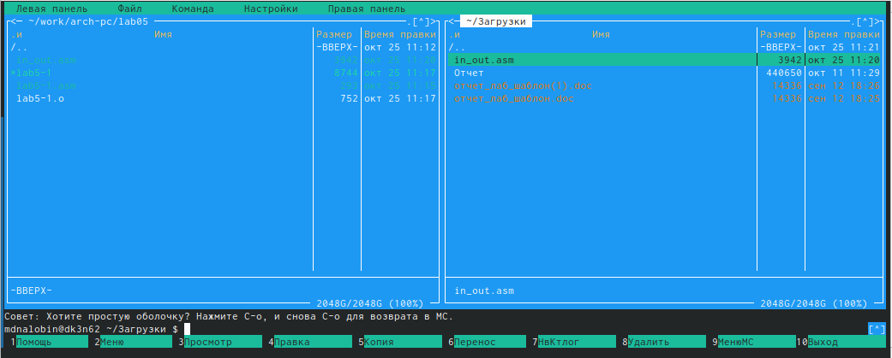
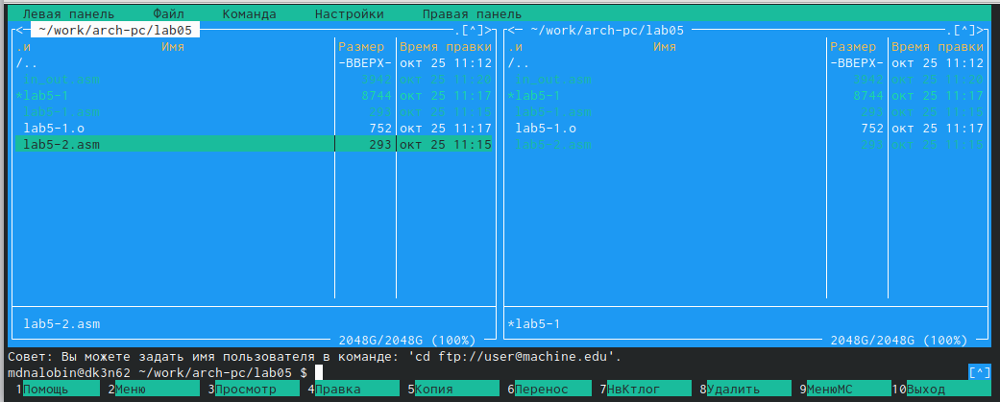
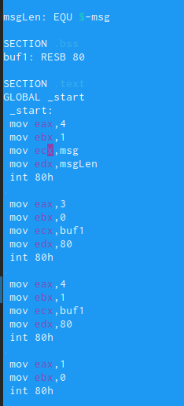
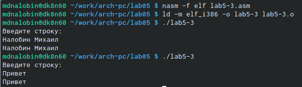
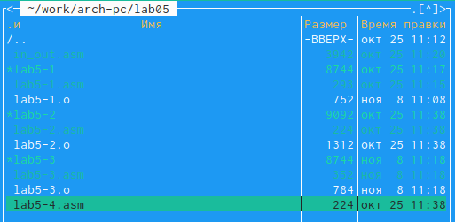
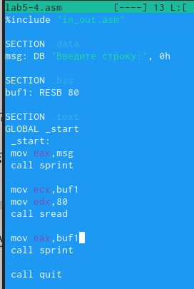

---
## Front matter
title: "Лабораторная работа №5"
subtitle: "Основы работы с Midnight Commander (mc). Структура программы на языке ассемблера NASM. Системные вызовы в ОС GNU Linux"
author: "Налобин Михаил Дмитриевич"

## Generic otions
lang: ru-RU
toc-title: "Содержание"

## Bibliography
bibliography: bib/cite.bib
csl: pandoc/csl/gost-r-7-0-5-2008-numeric.csl

## Pdf output format
toc: true # Table of contents
toc-depth: 2
lof: true # List of figures
lot: true # List of tables
fontsize: 12pt
linestretch: 1.5
papersize: a4
documentclass: scrreprt
## I18n polyglossia
polyglossia-lang:
  name: russian
  options:
	- spelling=modern
	- babelshorthands=true
polyglossia-otherlangs:
  name: english
## I18n babel
babel-lang: russian
babel-otherlangs: english
## Fonts
mainfont: PT Serif
romanfont: PT Serif
sansfont: PT Sans
monofont: PT Mono
mainfontoptions: Ligatures=TeX
romanfontoptions: Ligatures=TeX
sansfontoptions: Ligatures=TeX,Scale=MatchLowercase
monofontoptions: Scale=MatchLowercase,Scale=0.9
## Biblatex
biblatex: true
biblio-style: "gost-numeric"
biblatexoptions:
  - parentracker=true
  - backend=biber
  - hyperref=auto
  - language=auto
  - autolang=other*
  - citestyle=gost-numeric
## Pandoc-crossref LaTeX customization
figureTitle: "Рис."
tableTitle: "Таблица"
lofTitle: "Список иллюстраций"
lotTitle: "Список таблиц"
## Misc options
indent: true
header-includes:
  - \usepackage{indentfirst}
  - \usepackage{float} # keep figures where there are in the text
  - \floatplacement{figure}{H} # keep figures where there are in the text
---

# Цель работы

Обретение практических навыков использования Midnight Commander и закрепление работы с  инструкциями языка ассемблера mov и int.

# Ход работы

Открыли Midnight Commander, применив команду mc (рис. @fig:001).

{#fig:001 width=70%}

Используя клавиши, перешли в нужный каталог и с помощью клавиши F7 создали папку lab05 (рис. @fig:002).

{#fig:002 width=70%}

Создали командой touch файл lab5-1.asm, после чего клавишой F4 открыли его для редактирования и ввели предложенный текст программы (рис. @fig:003).

{#fig:003 width=70%}

Оттранслировали в объектный файл текст программы lab5-1.asm и скомпоновали сделанный файл, в конце запустив получившийся исполняемый файл (рис. @fig:004).

{#fig:004 width=70%}

Скачали файл in_out.asm со страницы ТУИС (рис. @fig:005).

{#fig:005 width=70%}

С помощью интерфейса Midnight Commander перенесли скачанный файл в каталог, где мы работаем (рис. @fig:006).

{#fig:006 width=70%}

Пользуясь клавишой F6, создали копию файла lab5-1.asm с именем lab5-2.asm (рис. @fig:007).

{#fig:007 width=70%}

Исправили текст программы в файле lab5-2.asm по приведенному листингу, затем создали исполняемый файл и проверили его (рис. @fig:008 и рис. @fig:009).

{#fig:008 width=70%}

{#fig:009 width=70%}

Заменили sprintLF на sprint в файле lab5-2.asm, после чего создали исполняемый файл, проверили работу и заметили, что **sprint не переводит на новую строку, а оставляет нас на прежней** (рис. @fig:010 и рис. @fig:011).

{#fig:010 width=70%}

{#fig:011 width=70%}

##Самостоятельная работа

Пользуясь клавишой F6, создали копию файла lab5-1.asm с именем lab5-3.asm, далее изменили так, чтобы она работала по заданному алгоритму, и, создав исполняемый файл, проверили работу (рис. @fig:012 и рис. @fig:013).

{#fig:012 width=70%}

{#fig:013 width=70%}

Создали копию файла lab5-2.asm с именем lab5-4.asm, далее изменили для работы предыдущему алгоритму и, создав исполняемый файл, проверили работу (рис. @fig:014, рис. @fig:015 и рис. @fig:016).

{#fig:014 width=70%}

{#fig:015 width=70%}

{#fig:016 width=70%}

# Выводы

В ходе данной лабораторной работы освоили процедуры компиляции и сборки программ, написанные на ассемблере NASM, на примере вывода сообщения 'Hello World!' и фамилией с именем.

:::
