---
## Front matter
title: "Лабораторная работа №6"
subtitle: "Арифметические операции в NASM"
author: "Налобин Михаил Дмитриевич"

## Generic otions
lang: ru-RU
toc-title: "Содержание"

## Bibliography
bibliography: bib/cite.bib
csl: pandoc/csl/gost-r-7-0-5-2008-numeric.csl

## Pdf output format
toc: true # Table of contents
toc-depth: 2
lof: true # List of figures
lot: true # List of tables
fontsize: 12pt
linestretch: 1.5
papersize: a4
documentclass: scrreprt
## I18n polyglossia
polyglossia-lang:
  name: russian
  options:
	- spelling=modern
	- babelshorthands=true
polyglossia-otherlangs:
  name: english
## I18n babel
babel-lang: russian
babel-otherlangs: english
## Fonts
mainfont: PT Serif
romanfont: PT Serif
sansfont: PT Sans
monofont: PT Mono
mainfontoptions: Ligatures=TeX
romanfontoptions: Ligatures=TeX
sansfontoptions: Ligatures=TeX,Scale=MatchLowercase
monofontoptions: Scale=MatchLowercase,Scale=0.9
## Biblatex
biblatex: true
biblio-style: "gost-numeric"
biblatexoptions:
  - parentracker=true
  - backend=biber
  - hyperref=auto
  - language=auto
  - autolang=other*
  - citestyle=gost-numeric
## Pandoc-crossref LaTeX customization
figureTitle: "Рис."
tableTitle: "Таблица"
lofTitle: "Список иллюстраций"
lotTitle: "Список таблиц"
## Misc options
indent: true
header-includes:
  - \usepackage{indentfirst}
  - \usepackage{float} # keep figures where there are in the text
  - \floatplacement{figure}{H} # keep figures where there are in the text
---

# Цель работы

Освоение навыка использования арифметических инструкций языка ассемблера NASM.

# Ход работы

Создали каталог lab06 для файлов лабораторной работы №6 и в нем файл lab6-1.asm (рис. @fig:001).

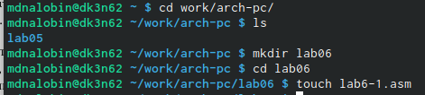{#fig:001 width=70%}

Открыли с помощью gedit файл lab6-1.asm и переписали в него пример Листинга 6.1. (рис. @fig:002).

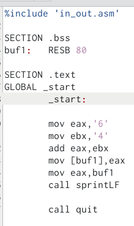{#fig:002 width=70%}

Далее создали исполняемый файл и запустили его (рис. @fig:003).

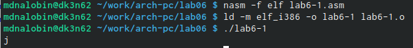{#fig:003 width=70%}

Снова открыли файл lab6-1.asm и заменили символы на регистры числа, после чего создали исполняемый файл и запустили его. В итоге наблюдаем, что символ не отображается, так как **символ с кодом 10 является перевод на новую строку** (рис. @fig:004 и рис. @fig:005).

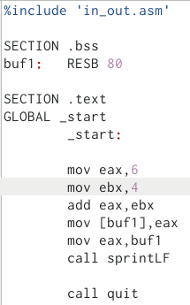{#fig:004 width=70%}

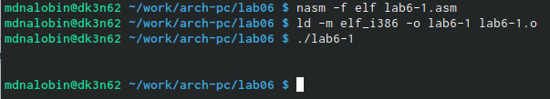{#fig:005 width=70%}

Создали файл lab6-2.asm и открыли для редактирования с помощью gedit (рис. @fig:006).

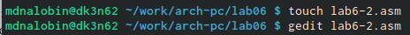{#fig:006 width=70%}

Используя в качестве примера Листинг 6.2., заполнили lab6-2.asm (рис. @fig:007).

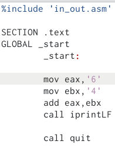{#fig:007 width=70%}

Затем создали исполняемый файл lab6-2 и запустили его (рис. @fig:008).

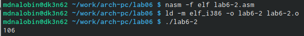{#fig:008 width=70%}

Как и в прошлом заменили символы на регистры числа, но уже в программе lab06-2.asm, создали его исполняемый файл и запустили. **В результате на выводе получили число 10** (рис. @fig:009 и рис. @fig:010).

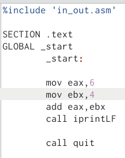{#fig:009 width=70%}

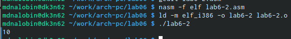{#fig:010 width=70%}

Заменили iprintLF на iprint в файле lab6-2.asm, после чего создали исполняемый файл, проверили работу и заметили, что **iprint не переводит на новую строку, а работа продолжается на прежней** (рис. @fig:011 и рис. @fig:012).

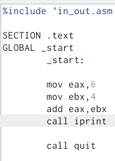{#fig:011 width=70%}

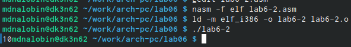{#fig:012 width=70%}

Создали файл lab6-3.asm (рис. @fig:013).

{#fig:013 width=70%}

Ввели в lab6-3.asm содержимое Листинга 6.3., создали исполняемый файл и запустили его (рис. @fig:014 и рис. @fig:015).

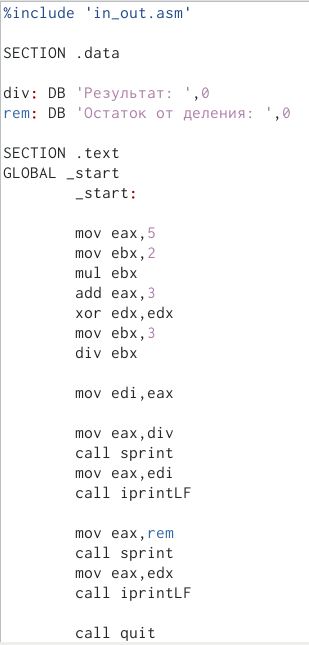{#fig:014 width=70%}

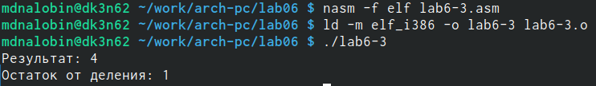{#fig:015 width=70%}

Далее изменили текст программы для вычисления следующего выражения *f(x) = (4 * 6 + 2)/5* (рис. @fig:016 и рис. @fig:017).

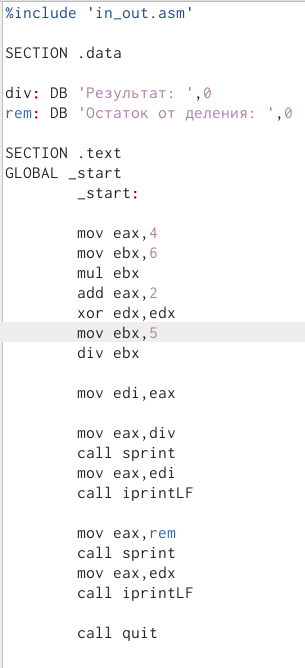{#fig:016 width=70%}

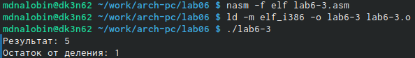{#fig:017 width=70%}

В качестве другого примера создали файл variant.asm (рис. @fig:018).

{#fig:018 width=70%}

Записали в него текст из Листинга 6.4. (рис. @fig:019).

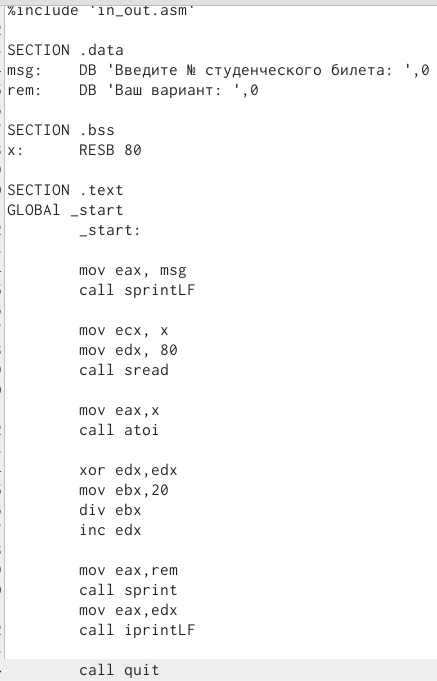{#fig:019 width=70%}

Создали исполняемый файл vatiant и запустили его. Получили свой вариант, в моем случае - 6 (рис. @fig:020).

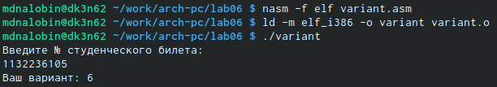{#fig:020 width=70%}

Ответы на вопросы:
1.  mov eax,rem
    call sprint
2. Они используются, чтобы в переменную x поместить число, введенное с клавиатуры.
3. Данная инструкция нудна для перевода символа числа в десятичную символьную запись.
4.  mov ebx,20
    div ebx
    inc edx
5. Остаток от деления записывает в регистр EDX.
6. inc edx увеличивает свой операнд на 1.
7.  mov eax,edx
    call iprintLF

##Самостоятельная работа

В новосозданном файле sr.asm и написали в нем код программы для выполнения выражения *(x^3)/2+1* (рис. @fig:021).

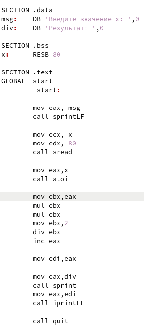{#fig:021 width=70%}

Затем сделали исполняемый файл и проверили работу программы для значений 2 и 5 (рис. @fig:022).

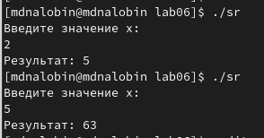{#fig:022 width=70%}

# Выводы

В ходе данной лабораторной работы освоили арифметические инструкции языка ассемблера NASM и на основе приобретенных знаний создали свою программу для вычисления выражения.

:::
