---
## Front matter
title: "Лабораторная работа №7"
subtitle: "Команды безусловного и условного переходов в Nasm. Программирование ветвлений"
author: "Налобин Михаил Дмитриевич"

## Generic otions
lang: ru-RU
toc-title: "Содержание"

## Bibliography
bibliography: bib/cite.bib
csl: pandoc/csl/gost-r-7-0-5-2008-numeric.csl

## Pdf output format
toc: true # Table of contents
toc-depth: 2
lof: true # List of figures
lot: true # List of tables
fontsize: 12pt
linestretch: 1.5
papersize: a4
documentclass: scrreprt
## I18n polyglossia
polyglossia-lang:
  name: russian
  options:
	- spelling=modern
	- babelshorthands=true
polyglossia-otherlangs:
  name: english
## I18n babel
babel-lang: russian
babel-otherlangs: english
## Fonts
mainfont: PT Serif
romanfont: PT Serif
sansfont: PT Sans
monofont: PT Mono
mainfontoptions: Ligatures=TeX
romanfontoptions: Ligatures=TeX
sansfontoptions: Ligatures=TeX,Scale=MatchLowercase
monofontoptions: Scale=MatchLowercase,Scale=0.9
## Biblatex
biblatex: true
biblio-style: "gost-numeric"
biblatexoptions:
  - parentracker=true
  - backend=biber
  - hyperref=auto
  - language=auto
  - autolang=other*
  - citestyle=gost-numeric
## Pandoc-crossref LaTeX customization
figureTitle: "Рис."
tableTitle: "Таблица"
lofTitle: "Список иллюстраций"
lotTitle: "Список таблиц"
## Misc options
indent: true
header-includes:
  - \usepackage{indentfirst}
  - \usepackage{float} # keep figures where there are in the text
  - \floatplacement{figure}{H} # keep figures where there are in the text
---

# Цель работы

1. Изучить команды условного и безусловного переходов
2. Освоить написание программ с использованием переходов
3. Познакомиться с назначением и структурой файла листинга

# Ход работы

Создали каталог lab07 для файлов лабораторной работы №7 и в нем файл lab7-1.asm (рис. @fig:001).

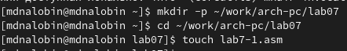{#fig:001 width=70%}

Открыли с помощью gedit файл lab7-1.asm и переписали в него пример Листинга 7.1. (рис. @fig:002).

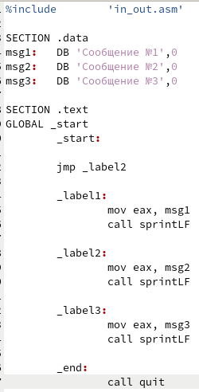{#fig:002 width=70%}

Далее создали исполняемый файл и запустили его (рис. @fig:003).

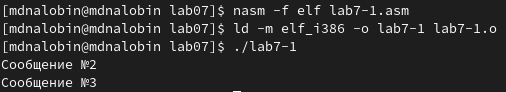{#fig:003 width=70%}

После чего снова открыли файл lab7-1.asm и изменили текст в соотвествии с Листингом 7.2. (рис. @fig:004).

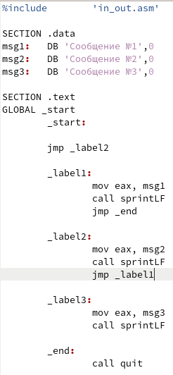{#fig:004 width=70%}

Так же создали исполняемый файл и запустили его (рис. @fig:005).

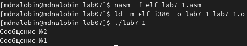{#fig:005 width=70%}

Затем опять изменили код программы lab7-1.asm, чтобы программа выводила сообщения в обратном порядке, создали исполняемый файл и запустили его (рис. @fig:006 и рис. @fig:007).

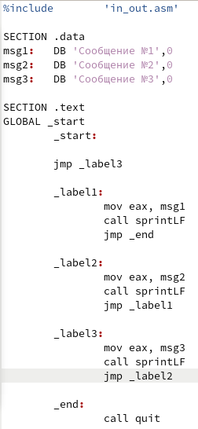{#fig:006 width=70%}

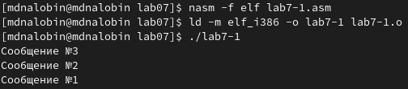{#fig:007 width=70%}

Создали файл lab7-2.asm и, внимательно изучив текс Листинга 7.3., заполнили его (рис. @fig:008 и рис. @fig:009).

{#fig:008 width=70%}

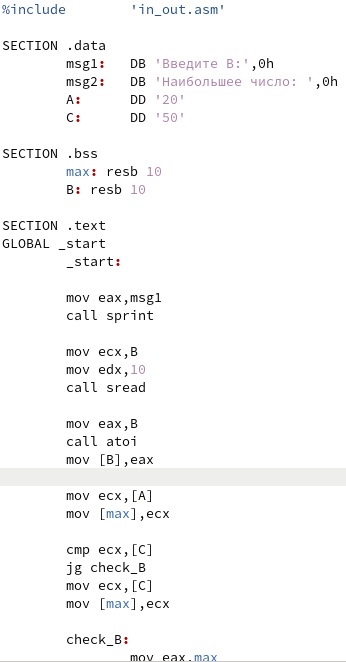{#fig:009 width=70%}

Далее создали исполняемый файл и запустили его, проверив на правильность работы (рис. @fig:010).

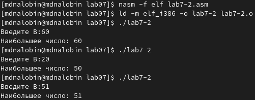{#fig:010 width=70%}

Создали файл листинга lab7-2.lst и открыли его с помощью редактора mcedit. Для объяснения возьмем строки 24-26. Первые числа являются номерами строк, затем идет адрес или же смещение от базового адреса структуры до интересующего вас поля, далее идет машинный код, показывающий итог ассемблирования исходной строки, и завершает листинг соответственно исходный код, где сначала введенное значение B перемещается в регитр eax для выполнения следующего хода, вызывается подпрограмма для перевода символа в число и число записывается обратно в B (рис. @fig:011 и рис. @fig:012).

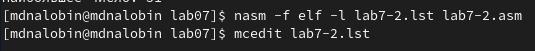{#fig:011 width=70%}

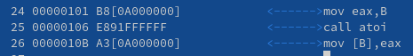{#fig:012 width=70%}

Открыли файл с программой lab7-2.asm и из инструкции mov убрал один из операндов (рис. @fig:013).

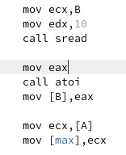{#fig:013 width=70%}

Пробуем оттранслировать для получения файла листинга, в результате чего получаем ошибку в консоле и в самом листинге (рис. @fig:014 и рис. @fig:015).

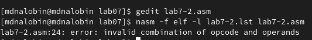{#fig:014 width=70%}

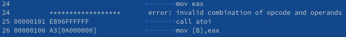{#fig:015 width=70%}

##Самостоятельная работа

Создали файл lab7-3.asm и написали в нем программу для нахождения наименьшего из 3 чисел (рис. @fig:016 и рис. @fig:017).

{#fig:016 width=70%}

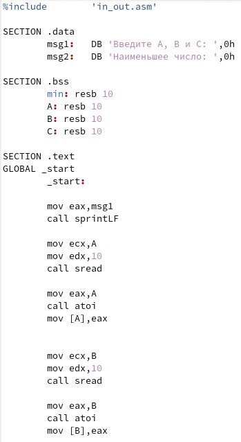{#fig:017 width=70%}

После создали исполняемый файл lab7-3 и проверили на корректность, используя числа из 6 и 1 вариантов (рис. @fig:018).

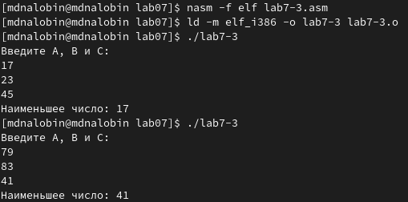{#fig:018 width=70%}

Создали файл lab7-4.asm и написали в нем программу для вычисления значения заданной функции по 6 варианту с переменными x и a, веденных с клавиатуры (рис. @fig:019 и рис. @fig:020).

{#fig:019 width=70%}

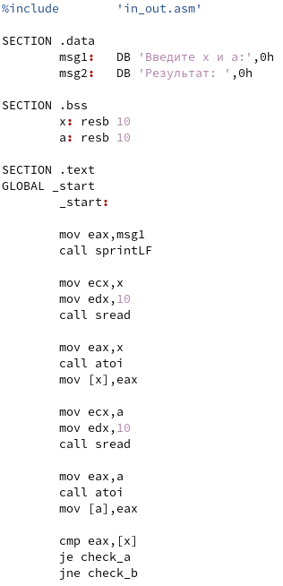{#fig:020 width=70%}

После создали исполняемый файл lab7-4 и проверили, подставив предоставленные значения для x и a (рис. @fig:021).

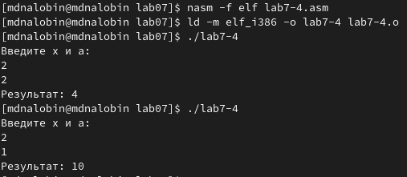{#fig:021 width=70%}

# Выводы

В ходе данной лабораторной работы поработали с командами условного и безусловного переходов, также приобрели навык написания программ с их использованием и изучили назначение и структуру файла листинга.

:::
