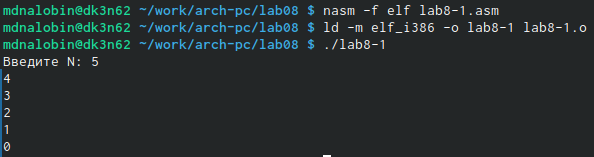

---
## Front matter
title: "Лабораторная работа №8"
subtitle: "Программирование цикла. Обработка аргументов командной строки"
author: "Налобин Михаил Дмитриевич"

## Generic otions
lang: ru-RU
toc-title: "Содержание"

## Bibliography
bibliography: bib/cite.bib
csl: pandoc/csl/gost-r-7-0-5-2008-numeric.csl

## Pdf output format
toc: true # Table of contents
toc-depth: 2
lof: true # List of figures
lot: true # List of tables
fontsize: 12pt
linestretch: 1.5
papersize: a4
documentclass: scrreprt
## I18n polyglossia
polyglossia-lang:
  name: russian
  options:
	- spelling=modern
	- babelshorthands=true
polyglossia-otherlangs:
  name: english
## I18n babel
babel-lang: russian
babel-otherlangs: english
## Fonts
mainfont: PT Serif
romanfont: PT Serif
sansfont: PT Sans
monofont: PT Mono
mainfontoptions: Ligatures=TeX
romanfontoptions: Ligatures=TeX
sansfontoptions: Ligatures=TeX,Scale=MatchLowercase
monofontoptions: Scale=MatchLowercase,Scale=0.9
## Biblatex
biblatex: true
biblio-style: "gost-numeric"
biblatexoptions:
  - parentracker=true
  - backend=biber
  - hyperref=auto
  - language=auto
  - autolang=other*
  - citestyle=gost-numeric
## Pandoc-crossref LaTeX customization
figureTitle: "Рис."
tableTitle: "Таблица"
lofTitle: "Список иллюстраций"
lotTitle: "Список таблиц"
## Misc options
indent: true
header-includes:
  - \usepackage{indentfirst}
  - \usepackage{float} # keep figures where there are in the text
  - \floatplacement{figure}{H} # keep figures where there are in the text
---

# Цель работы

Освоить навык работы с циклами и обработкой аргументов командой строки в программах на языке ассемблера NASM.

# Ход работы

Создали каталог lab08 для файлов лабораторной работы №8 и в нем файл lab8-1.asm (рис. @fig:001).

{#fig:001 width=70%}

Переписали в него текст из Листинга 8.1. (рис. @fig:002).

{#fig:002 width=50%}

После чего создали исполняемый файл и запустили его (рис. @fig:003).

{#fig:003 width=70%}

Далее изменяем содержание lab8-1.asm для демонстрации некорректной работы программы при использовании регистра ecx (рис. @fig:004).

{#fig:004 width=70%}

Так же создали исполняемый файл и запустили его. В данной программе ecx принимает все значения, но до eax доходит половина, поэтому и число проходов сокращается вдвое(причем округление при получение десятичного числа в большую сторону), что мы видим при выводе, так как ecx за ход цикла убывает на 1 два раза (при sub и loop)  (рис. @fig:005).

{#fig:005 width=70%}

Затем снова изменили код программы lab8-1.asm, чтобы использовать регистр ecx и при этом сохранить корректную работу цикла, использовав стек (рис. @fig:006).

{#fig:006 width=70%}

Создали исполняемый файл и запустили его. В результате получили соответствующее число проходов (рис. @fig:007).

{#fig:007 width=70%}

Создали файл lab8-2.asm и заполнили его текстом из Листинга 8.2. после внимательного изучения (рис. @fig:008 и рис. @fig:009).

{#fig:008 width=70%}

{#fig:009 width=50%}

Далее создали исполняемый файл и запустили его, указав аргументы. В итоге программой было выведино все три аргумента, следовательно, три аргумента было обработано (рис. @fig:010).

{#fig:010 width=70%}

Создали файл lab8-3.asm и ввели в него текст Листинга 8.3. (рис. @fig:011 и рис. @fig:012).

{#fig:011 width=70%}

{#fig:012 width=50%}

Создали исполняемый файл и запустили его, указав приведенные аргументы для проверки (рис. @fig:013).

{#fig:013 width=70%}

На этом этапе редактируем текст программы таким образом, чтобы она выводила произведение аргументов, создаем исполняемый файл и запускаем его, проверяя на работу при аргументах и их отсутствии. (рис. @fig:014 и рис. @fig:015).

{#fig:014 width=50%}

{#fig:015 width=70%}

##Самостоятельная работа

Создали файл sr.asm и написали в нем программу, которая находит сумму значений для некоторой функции, в моем случае - 4x-3, при заданных аргументах. (рис. @fig:016 и рис. @fig:017).

{#fig:016 width=70%}

{#fig:017 width=50%}

После создали исполняемый файл sr и проверили на корректность, используя два набора аргументов (рис. @fig:018).

{#fig:018 width=70%}

# Выводы

В ходе данной лабораторной работы приобрели навык использования циклов и обработки аргументов командной строки.

:::
