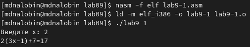
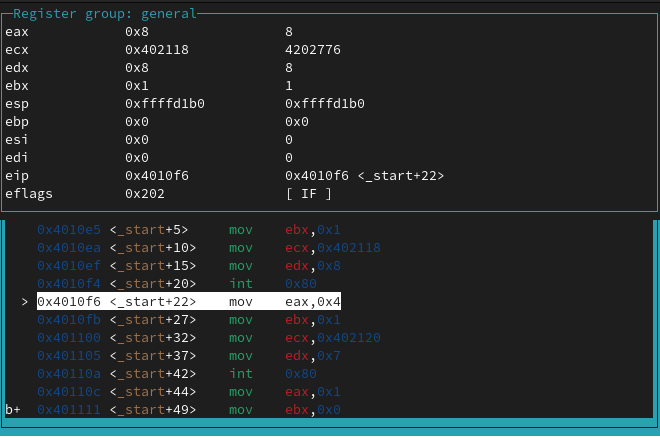
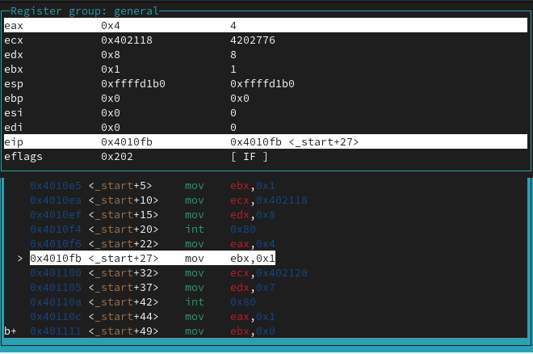
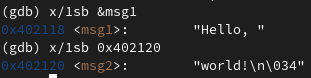
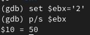
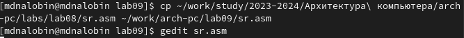

---
## Front matter
title: "Лабораторная работа №9"
subtitle: "Понятие подпрограммы. Отладчик GDB"
author: "Налобин Михаил Дмитриевич"

## Generic otions
lang: ru-RU
toc-title: "Содержание"

## Bibliography
bibliography: bib/cite.bib
csl: pandoc/csl/gost-r-7-0-5-2008-numeric.csl

## Pdf output format
toc: true # Table of contents
toc-depth: 2
lof: true # List of figures
lot: true # List of tables
fontsize: 12pt
linestretch: 1.5
papersize: a4
documentclass: scrreprt
## I18n polyglossia
polyglossia-lang:
  name: russian
  options:
	- spelling=modern
	- babelshorthands=true
polyglossia-otherlangs:
  name: english
## I18n babel
babel-lang: russian
babel-otherlangs: english
## Fonts
mainfont: PT Serif
romanfont: PT Serif
sansfont: PT Sans
monofont: PT Mono
mainfontoptions: Ligatures=TeX
romanfontoptions: Ligatures=TeX
sansfontoptions: Ligatures=TeX,Scale=MatchLowercase
monofontoptions: Scale=MatchLowercase,Scale=0.9
## Biblatex
biblatex: true
biblio-style: "gost-numeric"
biblatexoptions:
  - parentracker=true
  - backend=biber
  - hyperref=auto
  - language=auto
  - autolang=other*
  - citestyle=gost-numeric
## Pandoc-crossref LaTeX customization
figureTitle: "Рис."
tableTitle: "Таблица"
lofTitle: "Список иллюстраций"
lotTitle: "Список таблиц"
## Misc options
indent: true
header-includes:
  - \usepackage{indentfirst}
  - \usepackage{float} # keep figures where there are in the text
  - \floatplacement{figure}{H} # keep figures where there are in the text
---

# Цель работы

Приобрести навык написания программ с использованием подпрограмм и знакомство с методами отладки при помощи GDB и его основными возможностями.

# Ход работы

Создали каталог lab09 и в данном каталоге файл lab9-1.asm (рис. @fig:001).

{#fig:001 width=70%}

Переписали в него текст из Листинга 9.1. и, создав исполняемый файл, запустили lab9-1 (рис. @fig:002 и рис. @fig:003).

{#fig:002 width=50%}

{#fig:003 width=70%}

После чего изменили текст файла lab9-1.asm, добавив еще одну подпрограмму, создали исполняемый файл и запустили его (рис. @fig:004).

{#fig:004 width=70%}

{#fig:005 width=70%}

Создали файл lab9-2.asm и заполнили его текстом из Листинга 9.2. (рис. @fig:006 и рис. @fig:007).

{#fig:006 width=70%}

{#fig:007 width=50%}

Создаем исполняемый файл с применением ключа -g и загружаем его в отладчик gdb. Уже в самой оболочке проверяем работу программы и для более подробного анализа устанавливаем брейкпоинт на метку _start и запускаем снова (рис. @fig:008 и рис. @fig:009).

{#fig:008 width=70%}

{#fig:009 width=50%}

Далее смотрим дисассимилированный код программы с помощью команды disassemble, начиная с метки _start (рис. @fig:010).

{#fig:010 width=70%}

Затем переключили на отображение команд с синтаксисом intel, введя set disassembly-flavor intel, и снова применяем команду disassemble. Различие между синтаксисами ATT и Intel заключается в конструкции: у ATT первый после команды идет источник, а после приёмник; у Intel - Приёмник, источник (рис. @fig:011).

{#fig:011 width=70%}

Включили режим псевдографики для более удобного анализа программы (рис. @fig:012).

{#fig:012 width=50%}

Проверили установленную точку останова командой info breakpoints (кратко i b), после установили еще одну точку останова и проверили это (рис. @fig:013).

{#fig:013 width=70%}

Выполнили 5 инструкций с использованием команды stepi, проследив за изменениями регистров, и заметили это у регистров eax, ecx и edx на рис. 14-2, 14-4 и 14-5 соответственно (рис. @fig:014, рис. @fig:015, рис. @fig:016, рис. @fig:017 и рис. @fig:018).

{#fig:014 width=70%}

{#fig:015 width=70%}

{#fig:016 width=70%}

{#fig:017 width=70%}

{#fig:018 width=70%}

Посмотрели содержимое регистров с помощью команды info refisters (кратко i r) (рис. @fig:019).

{#fig:019 width=70%}

Посмотрели значение переменной msg1 по имени и msg2 по адресу (рис. @fig:020).

{#fig:020 width=70%}

Изменили командой set первого символа в msg1 и для втрого в msg2 (рис. @fig:021 и рис. @fig:022).

{#fig:021 width=70%}

{#fig:022 width=70%}

Вывели в различных форматах значение регистра edx (рис. @fig:023).

{#fig:023 width=70%}

С помощью команды set изменили значение ebx на символ 2, далее изменили значение на число 2. Так как в первом случае символ, а во втором число, то и выводится разное значение (рис. @fig:024 и рис. @fig:025).

{#fig:024 width=70%}

{#fig:025 width=70%}

Далее завершаем выполнение команды с помощью continue и выходис из GDB с помощью quit.

Копируем файл lab8-2.asm в наш каталог с именем lab9-3.asm и создаем исполняемый файл (рис. @fig:026 и рис. @fig:027).

{#fig:026 width=70%}

{#fig:027 width=70%}

С указанием аргументов загрузили исполняемый файл в отладчик, затем для исследования стека установили точку основы и запустили ее (рис. @fig:028).

{#fig:028 width=70%}

Просматриваем регистр esp, ибо в нем хранится число аргументов командой строки, включая имя программы и просматриваем позиции стека, изменяя шаг изменения адреса на 4 по причине того, что элемент стека занимает 4 байта (рис. @fig:029 и рис. @fig:030)

{#fig:029 width=70%}

{#fig:030 width=70%}

##Самостоятельная работа

Копируем sr.asm из каталога lab08 в lab09 и изменяем таким образом, чтобы вычисление значения функции f(x) было подпрограммой (рис. @fig:031 и рис. @fig:032)

{#fig:031 width=70%}

{#fig:032 width=50%}

Затем создаем исполняем файл и проверяем на правильную работу (рис. @fig:033).

{#fig:033 width=70%}

Создаем файл lab9-4.asm, записываем в него содержимое Листинга 9.3., создаем исполняемый файл и проверяем работу (рис. @fig:034 и рис. @fig:035)

{#fig:034 width=50%}

{#fig:035 width=70%}

С помощью отладчика GDB анализируем изменения значений регистров, чтобы определить место ошибок. В итоге обнаруживаем ошибку *в строке с mul ecx, потому что до этого мы прибавляем к ebx*, но команда mul может умножать лишь на eax, поэтому должны из строчки add ebx,eax получить add eax,ebx. *Следующая ошибка кроется в строчке add ebx,5, ведь ранее проводили операции над eax и именно eax несет в себе значение уже выполненных действий* (рис. @fig:036 и рис. @fig:037)

{#fig:036 width=70%}

{#fig:037 width=70%}

В этом этапе исправляем все найденные ошибки, создаем исполняемый файл и проверяем работу(рис. @fig:038 и рис. @fig:039)

{#fig:038 width=50%}

{#fig:039 width=70%}

# Выводы

В ходе данной длительной лабораторной работы приобрели навык, с помощью которого сможем писать программы с использованием подпрограмм, и познакомились с методами отладки с использованием GDB и его основными возможностями.

:::
