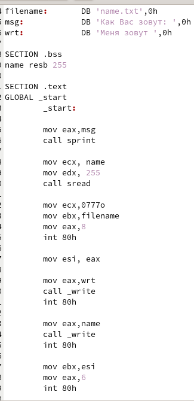

---
## Front matter
title: "Лабораторная работа №10"
subtitle: "Работа с файлами средствами Nasm"
author: "Налобин Михаил Дмитриевич"

## Generic otions
lang: ru-RU
toc-title: "Содержание"

## Bibliography
bibliography: bib/cite.bib
csl: pandoc/csl/gost-r-7-0-5-2008-numeric.csl

## Pdf output format
toc: true # Table of contents
toc-depth: 2
lof: true # List of figures
lot: true # List of tables
fontsize: 12pt
linestretch: 1.5
papersize: a4
documentclass: scrreprt
## I18n polyglossia
polyglossia-lang:
  name: russian
  options:
	- spelling=modern
	- babelshorthands=true
polyglossia-otherlangs:
  name: english
## I18n babel
babel-lang: russian
babel-otherlangs: english
## Fonts
mainfont: PT Serif
romanfont: PT Serif
sansfont: PT Sans
monofont: PT Mono
mainfontoptions: Ligatures=TeX
romanfontoptions: Ligatures=TeX
sansfontoptions: Ligatures=TeX,Scale=MatchLowercase
monofontoptions: Scale=MatchLowercase,Scale=0.9
## Biblatex
biblatex: true
biblio-style: "gost-numeric"
biblatexoptions:
  - parentracker=true
  - backend=biber
  - hyperref=auto
  - language=auto
  - autolang=other*
  - citestyle=gost-numeric
## Pandoc-crossref LaTeX customization
figureTitle: "Рис."
tableTitle: "Таблица"
lofTitle: "Список иллюстраций"
lotTitle: "Список таблиц"
## Misc options
indent: true
header-includes:
  - \usepackage{indentfirst}
  - \usepackage{float} # keep figures where there are in the text
  - \floatplacement{figure}{H} # keep figures where there are in the text
---

# Цель работы

Приобрести навык написания программ для работы с файлами на языке ассемблера NASM.

# Ход работы

Создали каталог lab10 для файлов лабораторной работы №10 и в нем файлы lab10-1.asm, readme-1.txt и readme-2.txt (рис. @fig:001).

{#fig:001 width=70%}

Открыли lab10-1.asm и переписали в него текст из Листинга 10.1. (рис. @fig:002).

{#fig:002 width=50%}

После чего создали исполняемый файл, запустили его и на этапе проверки заметили, что файла readme.txt нет, так как мы его не создавали, а программа написана на открытие существующего файла (рис. @fig:003).

{#fig:003 width=70%}

Чтобы это исправить, создадим файл readme.txt и снова проверим работу lab10-1 (рис. @fig:004).

{#fig:004 width=70%}

Использовав команду chmod, запретили выполнение исполняемого файла lab10-1, после чего попробовав выполнить его и, очевидно, получили отказ, так как запрет выполнение ведет к невозможности выполнения (рис. @fig:005).

{#fig:005 width=70%}

Затем снова с помощью chmod изменили права доступа, но к файлу lab10-1.asm, предоставив права на исполнение, и попытались исполнить его, что привело к множеству ошибок. Это произошло, потому что файл lab10-1.asm не предназначен для выполнения (рис. @fig:006).

{#fig:006 width=70%}

Далее в соответствии с вариантом 6 предоставили права доступа для файлов readme-1.txt и readme-2.txt, переведя символьный и двоичный вид в восьмиричныйб и проверили правильность работы командой ls -l (рис. @fig:007).

{#fig:007 width=70%}

##Самостоятельная работа

Написали программу работающую по предоставленному алгоритму и запустили ее, проверив два раза (рис. @fig:08 и рис. @fig:09).

{#fig:08 width=50%}

{#fig:09 width=70%}

# Выводы

В ходе данной лабораторной работы приобрели навык написания программ для работы с файлами.

:::
